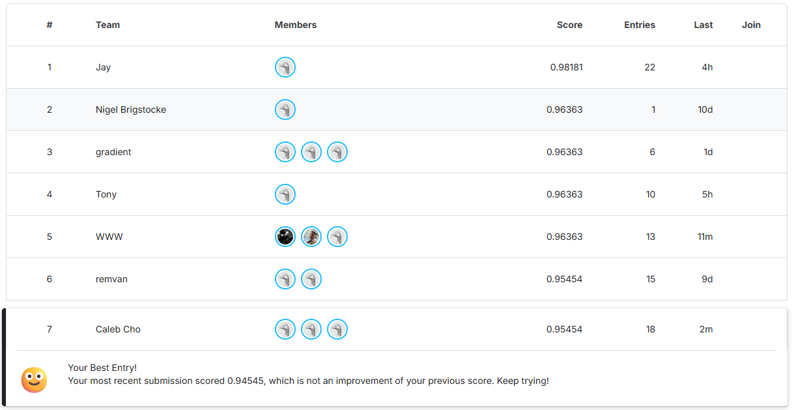

# CSE 144 Spring 2026 — Final Project

**100-Class Image Classification via Transfer Learning**

Team: Sequoia Boubion-McKay, Kevin Chan, Caleb Cho

---

## Kaggle Leaderboard

**Best score: 0.95454 — 7th place (public leaderboard)**



---

## Repository Structure

```
cse144-spring-26-final/
├── caleb/          # Caleb's pipeline — SigLIP2, 121-config search, final submission
├── kevin/          # Kevin's pipeline — ConvNeXt + ViT-CLIP ensemble
├── sequoia/        # Sequoia's pipeline — ConvNeXt baseline, production code
├── leaderboard.png
└── master_report.md
```

The final submission (0.95454) was produced by **Caleb's pipeline** using SigLIP2-SO400M-384 with self-distillation pseudo-labeling. Instructions for all three pipelines are below.

---

## Final Submission — Caleb's Pipeline (`caleb/`)

**Model:** `google/siglip2-so400m-patch16-384`  
**Framework:** HuggingFace Transformers  
**Hardware:** NVIDIA GPU (CUDA), Windows Python recommended for native CUDA throughput  
**Python:** 3.12

### Setup

```bash
cd caleb
pip install torch torchvision --index-url https://download.pytorch.org/whl/cu128
pip install -r requirements.txt
```

A HuggingFace token is required for DINOv3 (access-gated). Create a `.env` file:

```
HF_TOKEN=your_token_here
```

Place the dataset at `data/train/` and `data/test/` relative to `caleb/`.

### Training

Run the full 5-fold cross-validation pipeline with pseudo-labeling (Round 1 + Round 2):

```bash
python pipeline.py
```

This trains SigLIP2-SO400M-384 (unfreeze=2, lr=1e-4, LLRD=0.8, 20 epochs), generates self-distillation pseudo-labels at confidence threshold=0.97, retrains in Round 2, and writes `submission.csv`.

To run the full 121-config hyperparameter search instead:

```bash
python search.py
```

Results are written incrementally to `search_results.csv`.

### Inference

After training, generate a Kaggle-ready submission from saved checkpoints:

```bash
python pipeline.py --export pipeline_result.txt
```

To submit directly to Kaggle:

```bash
python pipeline.py --submit --message "SigLIP2 R2 self-distillation"
```

### Key Hyperparameters (Best Config)

| Setting | Value |
|---|---|
| Backbone | `google/siglip2-so400m-patch16-384` |
| Unfreeze blocks | 2 of 27 |
| Learning rate | 1e-4 |
| LLRD decay | 0.8 |
| Epochs | 20 |
| Batch size | 16 |
| Pseudo-label threshold | 0.97 |
| CV | 5-fold StratifiedKFold, seed=42 |

### Trained Model Weights

**Google Drive (SigLIP2-SO400M-384 — final submission model):**  
https://drive.google.com/drive/folders/1-N_JySogMGkLquP1N02XMOGPFBNSvwUG?usp=sharing

**Google Drive (ConvNeXt-B — Sequoia's baseline):**  
https://drive.google.com/drive/folders/1B2p5ubG2Yc7x4FiWw4xVz9-ZXNZAlHzD?usp=share_link

Download the SigLIP2 checkpoint folder and place it under `caleb/` before running inference.

---

## Kevin's Pipeline (`kevin/`)

**Model:** ConvNeXt-Small, ConvNeXt-Base, ViT-base-CLIP ensemble  
**Framework:** `timm`  
**Hardware:** NVIDIA RTX 3080 (10 GB VRAM)  
**Kaggle score:** 0.87 (Run 3, 3-model ensemble)

### Setup

```bash
cd kevin
pip install -r requirements.txt
```

### Training

```bash
# Train each backbone
python src/train.py --backbone convnext_small --aug-profile softer
python src/train.py --backbone convnext_base --aug-profile softer
python src/train.py --backbone vit_base_clip --aug-profile softer
```

All hyperparameters are in `config.yaml`. Checkpoints are saved under `checkpoints/<backbone>/`.

### Inference

```bash
python src/predict.py --out submission_vit_ensemble.csv
```

This generates a 1,036-row submission using the 3-model ensemble (ConvNeXt-S × 1 + ConvNeXt-B × 1 + ViT-CLIP × 3) with 6-pass multi-scale TTA (3 scales × horizontal flip).

---

## Sequoia's Pipeline (`sequoia/`)

**Model:** ConvNeXt-Small, ConvNeXt-Base  
**Framework:** `timm`, device-agnostic (CUDA / Apple MPS / CPU)  
**Kaggle score:** 0.80 (ConvNeXt-S)

### Setup

```bash
cd sequoia
pip install -r requirements.txt
```

### Training

```bash
# Train ConvNeXt-B across all five folds (MPS)
PYTORCH_ENABLE_MPS_FALLBACK=1 python src/train.py \
  --backbone convnext_base --device mps --batch-size 8 --out checkpoints_local

# Train ConvNeXt-S (CUDA or CPU)
python src/train.py --backbone convnext_small --out checkpoints_local
```

### Inference

```bash
# Report OOF ensemble accuracy
python src/oof_ensemble.py \
  --ckpt-dir checkpoints_local \
  --backbones convnext_small,convnext_base

# Generate 1,036-row submission
python src/predict.py \
  --ckpt-dir checkpoints_local \
  --backbones convnext_base \
  --out outputs/submissions/submission.csv
```

---

## Dataset

Place the competition data as follows (same structure for all three pipelines, relative to each member's directory):

```
data/
  train/
    0/    # ~10 images per folder
    1/
    ...
    99/
  test/
    0.jpg
    1.jpg
    ...
    1035.jpg
  sample_submission.csv
```

- Training set: 1,079 images across 100 classes
- Test set: 1,036 images (note: `sample_submission.csv` has only 1,000 rows — all inference scripts enumerate all 1,036 test files directly)

---

## Report

See [master_report.pdf](master_report.pdf) for the full group report covering all three approaches, experimental results, and analysis. The source is also available as [master_report.md](master_report.md).
